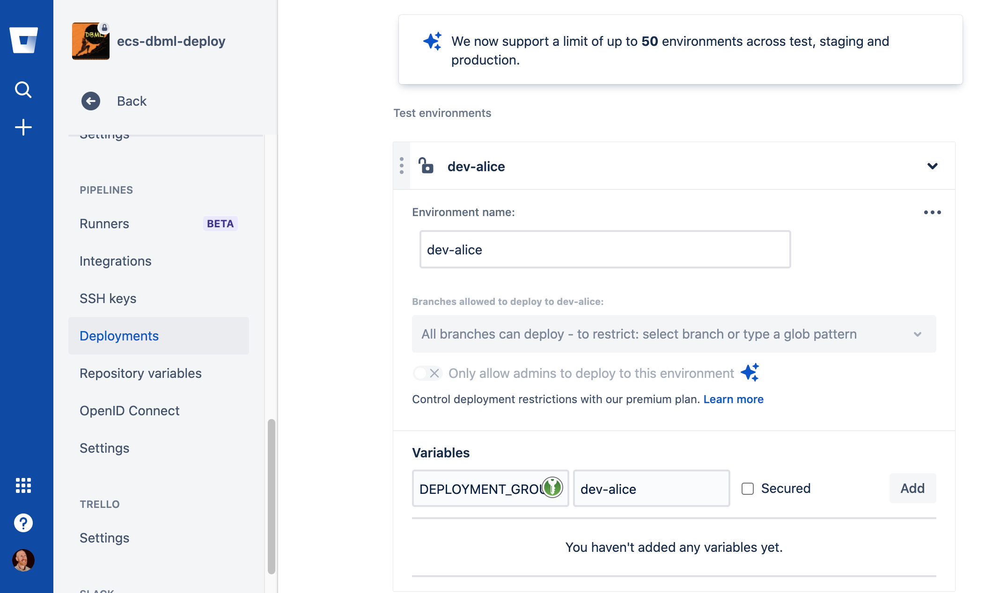
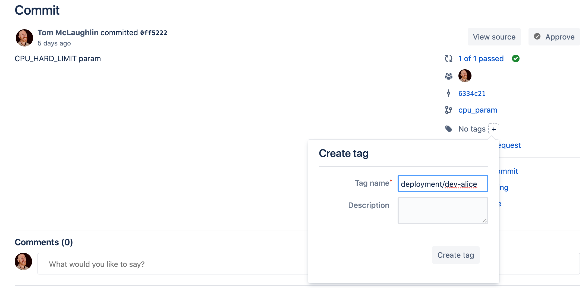
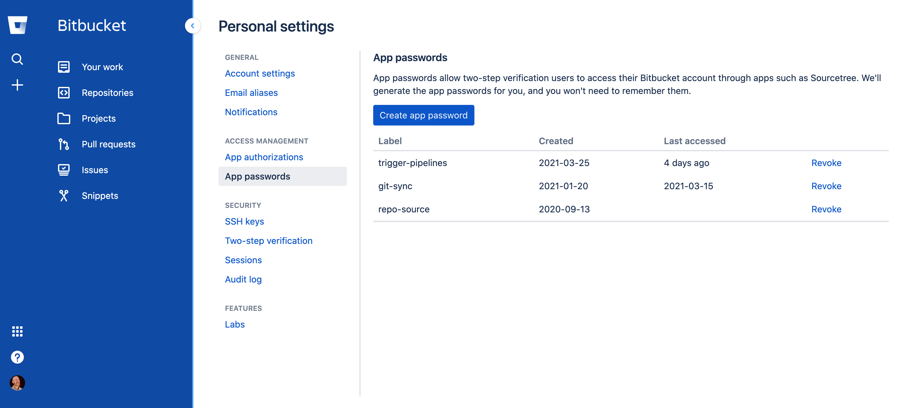

# Our Problem

I'd like to address how to handle lots of _environments_ within BitBucket
Pipelines, as I haven't seen much written about this. Below I'm presenting
two options

1. Using tags to parameterize Builds
2. Using the BitBucket API

My team is responsible for an application that is composed of roughly ten
backend services, plus a handful of projects which deploy static resources
to a CDN. Additionally, we have roughly twenty target environments, each
of which may have an arbitrary combination of the above projects.

## Why So Many Environments?

Some of the environments correspond to familiar ones. So, for example,
there may be four "dev" environments. Others are ad-hoc environments
provisioned specifically for integration work with a particular client.
The proliferation of environments is a result of licensing restrictions,
teams working in diffrent continents at different cadences, and clients
with specific integration needs.

## Pipelines

Each service or web resource bundle is packaged into its own git repository. Our
pipelines deploy using either AWS CodeDeploy or by updating AWS ECS Services, but
it's not particularly relevant here.

We are starting from something like this, where we have a number of environments
that developers frequently deploy to.

```yaml
image: openjdk:8

clone:
  depth: full

definitions:
  build-application: &build-application
    name: Build Application
    script:
      ## Call Gradle, Rake, Makefile, Docker, or whatever to build,
      ## run unit tests, and create some artifact.
  register-revision: &register-revision
    name: Register Revision
    script:
      ## Publish our artifact (jar, zip, container image, etc) to
      ## some repository like Artifactory, S3, or DockerHub.
pipelines:
  custom:
    dev-alice:
      - step: *build-application
      - step: *register-revision

      # I've include our specific CodeDeploy script here. The important
      # part here is the "deployment-group-name", which corresponds to
      # each of the 20 environments.
      - step:
          image: aneitayang/aws-cli:1.0
          script:
            - aws --region us-east-1 deploy create-deployment \
              --application-name $BITBUCKET_REPO_SLUG \
              --s3-location bucket=$S3_BUCKET,bundleType=zip,key=$BITBUCKET_REPO_SLUG/$BITBUCKET_BUILD_NUMBER.zip \
              --deployment-group-name dev-alice
    dev-bob:
      - step: *build-application
      - step: *register-revision
      - step:
          image: aneitayang/aws-cli:1.0
          script:
            - aws --region us-east-1 deploy create-deployment \
              --application-name $BITBUCKET_REPO_SLUG \
              --s3-location bucket=$S3_BUCKET,bundleType=zip,key=$BITBUCKET_REPO_SLUG/$BITBUCKET_BUILD_NUMBER.zip \
              --deployment-group-name dev-bob
    dev-carol:
      - step: *build-application
      - step: *register-revision
      - step:
          image: aneitayang/aws-cli:1.0
          script:
            - aws --region us-east-1 deploy create-deployment \
              --application-name $BITBUCKET_REPO_SLUG \
              --s3-location bucket=$S3_BUCKET,bundleType=zip,key=$BITBUCKET_REPO_SLUG/$BITBUCKET_BUILD_NUMBER.zip \
              --deployment-group-name dev-carol
```

This is simple, and we could cut-and-paste our way to victory by adding the other
seventeen environments and changing the names where needed. Here, the
"deployment-group-name" corresponds to our target environment. But we'd also have
to do this in each of our projects. This seems like a lot of hard-coding. Could there
be a way to parameterize this?

## Variables in BitBucket

BitBucket provides us with variables in a few different "scopes"

1. Workspace
2. Repository
3. Deployment Environment

Workspace and Repository variables don't help us, but maybe we could make use of
those variables.

The easiest way to specify variables is to define them via the Repository Settings UI.



We can then reference them 

```yaml
dev-alice:
  - step: *build-application
  - step: *register-revision

  # I've include our specific CodeDeploy script here. The important
  # part here is the "deployment-group-name", which corresponds to
  # each of the 20 environments.
  - step:
      image: aneitayang/aws-cli:1.0

      # The "deployment" here matches the environment we defined
      # in the Deployment Settings menu
      deployment: dev-alice

      # The DEPLOYMENT_GROUP variable below is specific to the
      # "dev-alice" group. But does that help us?
      script:
        - aws --region us-east-1 deploy create-deployment \
          --application-name $BITBUCKET_REPO_SLUG \
          --s3-location bucket=$S3_BUCKET,bundleType=zip,key=$BITBUCKET_REPO_SLUG/$BITBUCKET_BUILD_NUMBER.zip \
          --deployment-group-name "$DEPLOYMENT_GROUP"
```

No, this doesn't seem right. We've just added _more_ configuration, and it still seems
rather hard-coded. In Jenkins, we can add parameters that developers select
from DropDowns during their deploys, but BitBucket doesn't provide this
functionality (yet). So how can we paramterize our builds?

## Tags as Parameters

Bitbucket exposes a `BITBUCKET_TAG` environment variable to us. So we could
add a "tags" section to our bitbucket-pipelines.yml. Note here that
we've replaced "dev-alice" with "$BITBUCKET_TAG".

```yaml
tags:
  'deployment/**':
    - step: *build-application
    - step: *register-revision
    - step:
        image: aneitayang/aws-cli:1.0
        script:
          - aws --region us-east-1 deploy create-deployment \
            --application-name $BITBUCKET_REPO_SLUG \
            --s3-location bucket=$S3_BUCKET,bundleType=zip,key=$BITBUCKET_REPO_SLUG/$BITBUCKET_BUILD_NUMBER.zip \
            --deployment-group-name $BITBUCKET_TAG
    - step:
      name: Cleanup Tag
      script:
        - git push --delete origin ${BITBUCKET_TAG}
```

Our developers can then use the GUI to tag their commits to get a deploy
to an arbitrary environment.



Likewise, they can tag the commit and push it.

```sh
git tag deployment/dev-alice
git push origin deployment/dev-alice
```

So now, if we need to deploy to an integration environment for a new or
prospective customer, we can do it without having to modify any of our
pipelines.

I don't think this is ideal, but it lets us use almost identical boilerplate
to what we have without imposing much change on developers.

## BitBucket API

Another way to pass arbitrary variables to BitBucket is via its API. See
[Trigger Pipeline For Branch](https://developer.atlassian.com/bitbucket/api/2/reference/resource/repositories/%7Bworkspace%7D/%7Brepo_slug%7D/pipelines/#post)

Here we define $DEPLOYMENT_GROUP, very similar to what we did above with the
"deployments:" line.

```yaml
custom:
  deploy-task:
    - step: *build-application
    - step: *register-revision
    - step:
        image: aneitayang/aws-cli:1.0
        script:
          - aws --region us-east-1 deploy create-deployment \
            --application-name $BITBUCKET_REPO_SLUG \
            --s3-location bucket=$S3_BUCKET,bundleType=zip,key=$BITBUCKET_REPO_SLUG/$BITBUCKET_BUILD_NUMBER.zip \
            --deployment-group-name $DEPLOYMENT_GROUP
```

First you'll need to obtain an API token, which is done in your account's [Personal Settings](https://bitbucket.org/account/settings/app-passwords/).



With the password stowed away, we can pass the "DEPLOYMENT_GROUP" variable via a REST call.

```sh
# Be sure to change MY_WORKSPACE and MY_GIT_REPO!
# We're using a custom branch here, "AWS-860", and
# "DEPLOYMENT_GROUP" is a variable we reference in the
# pipeline like any other variable.
curl -X POST -is -u tmclnk:myapppassword01234  -H 'Content-Type: application/json'  https://api.bitbucket.org/2.0/repositories/MY_WORKSPACE/MY_GIT_REPO/pipelines/ -d '{
  "target": {
    "type": "pipeline_ref_target",
    "ref_type": "branch",
    "ref_name": "AWS-860",
    "selector": {
      "type": "custom",
      "pattern": "deploy-task"
    }
  },
  "variables": [
    {
      "key": "DEPLOYMENT_GROUP",
      "value": "dev-alice"
    }
  ]
}'
```

## Wrapup

BitBucket pipelines allows us to get arbitrary variables into our pipelines,
but we can't (yet) do it via select lists or freeform text boxes during
the deployment workflow in the GUI. There are other strategies, like offloading
the deployment portion of this workflow to another tool and parameterizing it
there. Our team is accustomed to BitBucket, so we aren't keen on making our team
learn the mechanics of how their deployments work unless they are interested
in it.
